# longscroll-qt
[](https://travis-ci.org/TripleWhy/longscroll-qt) [](https://ci.appveyor.com/project/TripleWhy/longscroll-qt/branch/master)


longscroll-qt is a C++ library to create very long, fast and responsive scrollable widgets in Qt.

The longscroll widget can visualize a large list of items, similar to a QAbstractItemView.
The main differences are that longscroll-qt is responsive, has much more flexible layout options and uses real widgets to display items.
This allows easy user interaction and simple customization as you can for example use the Qt designer to create an item widget.
longscroll-qt also offers a fully customizable navigator widget wich is shown between two rows, creating a complete google-images-like view.

The library was tested and works with millions of image items.

## API Docs
Online documentation for the current release can be found at https://triplewhy.gitlab.io/longscroll-qt/doc/.

You can also [download](../../releases) a html or qhp version to integrate into Qt Assistant and Qt Creator.

## Examples
The library comes with two [examples](examples). To understand the behavior best, keep resizing the window.
- [examples/simple](examples/simple) sets up a simple program using only a few lines of code to get you up running fast.
- [examples/demo](examples/demo) deomstrates the power of longscroll-qt by providing a gui that lets you dynamically change nearly every setting to see what it does.

The documentation of [longscroll::ContentWidget](https://triplewhy.gitlab.io/longscroll-qt/doc/classlongscroll_1_1_content_widget.html) can give a good overview of what longscroll-qt can do, as most of its functionality is provided by that class.

## Stylesheets
longscroll-qt widgets can be styled like any other widget. Since longscroll-qt uses a namespace, `longscroll` by default, stylesheets have to specify it too. For example:
```css
longscroll--ContentWidget {
	background: blue;
}
longscroll--ImageWidget {
	background: yellow;
}
```

## Requirements
longscroll-qt needs Qt 5 and a C++11 compatible compiler. It can run on all systems that have Qt, including Linux, Windows and Mac OS X.
Building the documentation additionally requires doxygen and graphviz.

On Ubuntu all requirements (including docs) can be installed with the following packages:
```
# apt-get install build-essential clang qtbase5-dev qtbase5-doc-html qttools5-dev-tools doxygen graphviz libqt5sql5-sqlite
```

## Compiling
Compiling is as easy as with any other Qt program. You can either open src/longscroll-qt.pro in your favorite IDE or use qmake directly. In both cases you shold additionally build the install target.
The examples are examples/simple/simple.pro and examples/demo/demo.pro.

Compiling from the command line could be for example like this:
```
cd src
qmake
make
make install

# Build and run examples:

cd ..
cd examples/simple/
qmake
make
make install
LD_LIBRARY_PATH=<longscroll-qt lib dir> ./simple <some dir>
# for example:
LD_LIBRARY_PATH=../../dist/linux-g++-64/lib ./simple ~/Pictures/

cd ..
cd demo/
qmake
make
make install
LD_LIBRARY_PATH=<longscroll-qt lib dir> ./demo [some dir [demo number]]
# for example:
LD_LIBRARY_PATH=../../dist/linux-g++-64/lib ./demo
```
Notes:
- You might have to use `qmake -qt=5` on ubuntu.
- Replace `make` by `nmake` or `jom` when building a msvc version.

### Additional Make Targets
```
make install
make docHtml
make docQhp
make docs
```
- `install`  Installs the library into the dist directory.
- `docHtml`  Creates html documentation inside the dist directory.
- `docQhp`   Creates qhp documentation inside the dist directory. This can be loaded in Qt Assistant and Qt Creator.
- `docs`     Creates html and qhp documentation.

## Screenshots
This library can best be experienced by running and resizing the demo program.
The following are some layout possibilities from the documentation (they are actual screen shots):

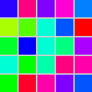
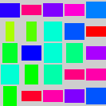
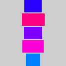
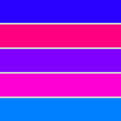
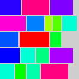
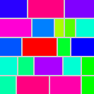

Alright here are some real screenshots anyway:

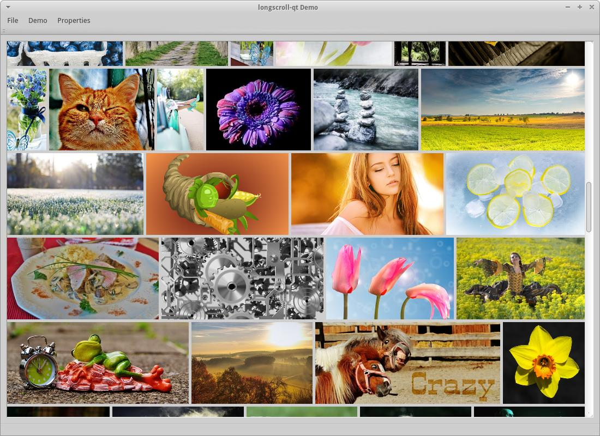

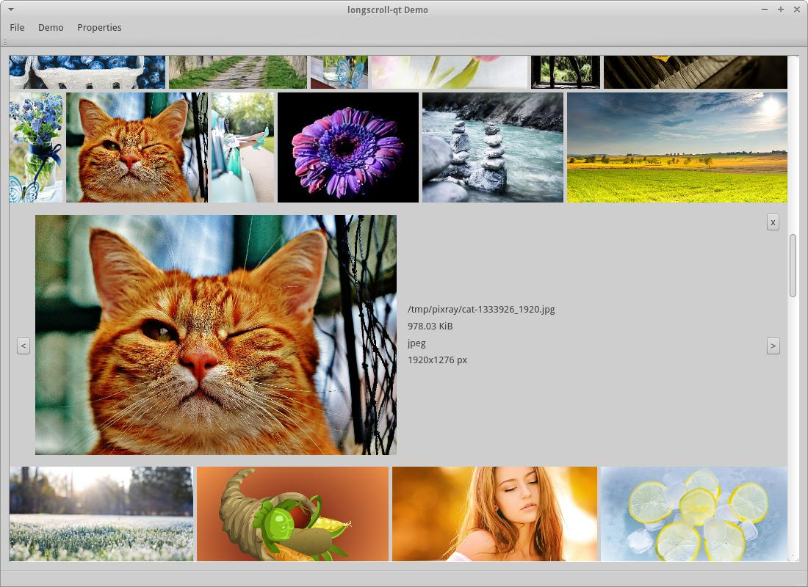

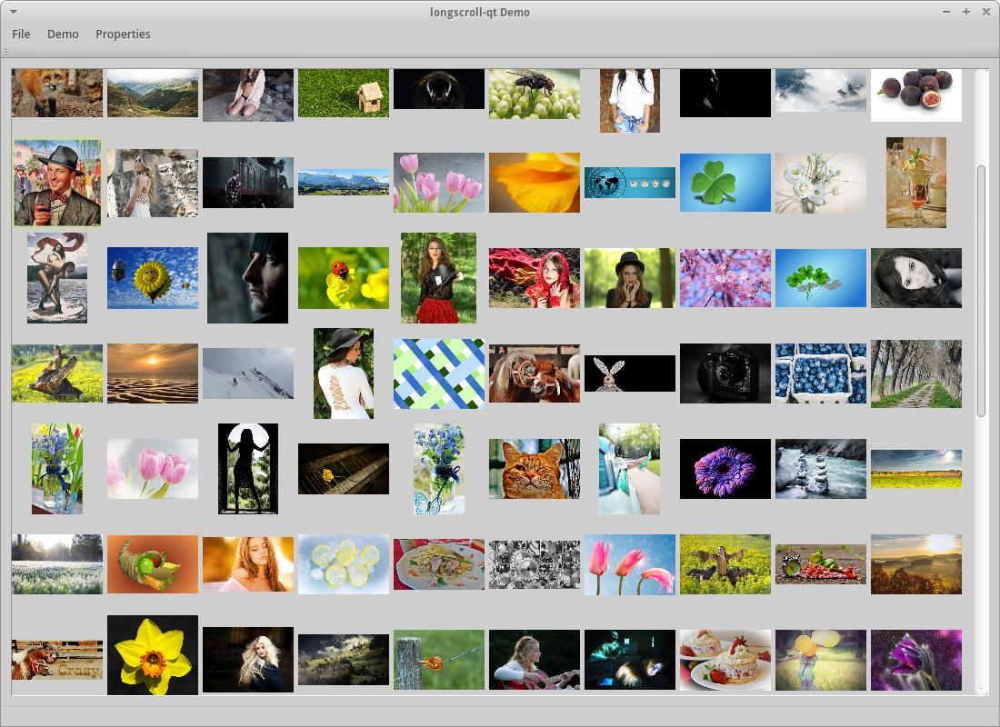

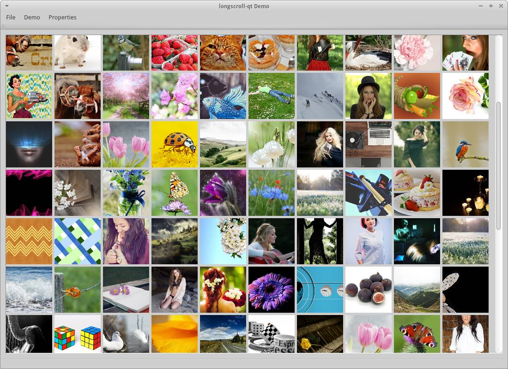

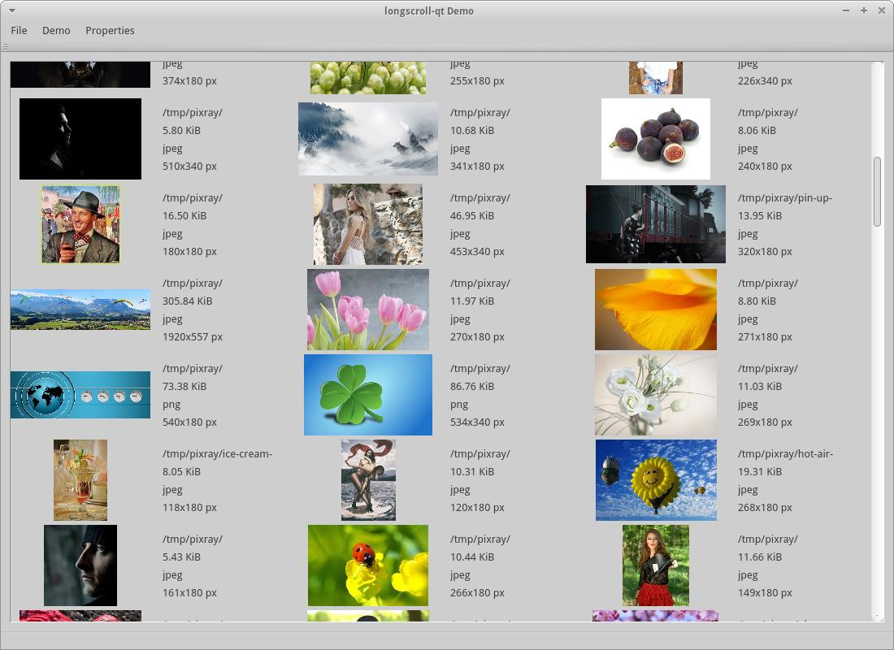

## License
longscroll-qt is licensed under AGPL v3. (Contact me if you need a commercial license.)
